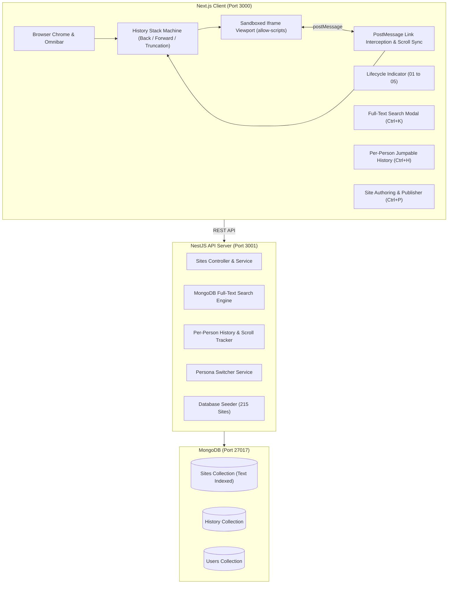

# The Small Web & The Browser You Read It In: Technical Walkthrough

A full-stack application built according to the **Full Stack Technical Test (Web Engineering)** specification.

GitHub Repository: [https://github.com/MuhammadUmar2132/Assessment.git](https://github.com/MuhammadUmar2132/Assessment.git)

---

## 1. System Architecture



---

## 2. Fulfillment of Core Requirements

### 1. Four Capabilities
1. **Browse**: Users can type any address into the omnibar (e.g. `welcome`, `garden/digital-gardening`, `users/alice`, `arcade/space-invaders`) or click any hyperlink inside a rendered document.
2. **Retrace**:
   - Strict browser history stack machine with `backStack`, `current`, and `forwardStack`.
   - **Forward stack truncation**: When stepping back into history and navigating to a *new* address, the forward stack is permanently cleared (the real law of browser navigation).
   - **Restore on return**: Scroll positions are tracked in real-time and restored faithfully when navigating back or forward.
   - **Per-person history**: Browsing history belongs strictly to the currently selected persona (Alice, Bob, Charlie, Dana, Eve). History is scrollable and jumpable.
3. **Search**: Full-text search computed across the actual *body content* of all 215 pages using MongoDB's text indexing with snippet excerpt generation.
4. **Publish**: Anyone can publish or update a site at any slug address with raw HTML under their persona.

### 2. The Five Lifecycle States

| State | Badge | Description | Trigger |
| :--- | :--- | :--- | :--- |
| **01 Typed** | `01 Typed` | An address entered into the Omnibar | User submits an address |
| **02 Loading** | `02 Loading` | Asked for, not shown | Network resolution in progress |
| **03 Shown** | `03 Shown` | Read, and recorded | Document successfully retrieved & rendered; visit recorded in DB |
| **04 In History** | `04 In history` | Been here before | User has previously visited this address in their persona history |
| **05 Nowhere** | `05 Nowhere` | No such address (404) | Document does not exist or broken link followed |

---

## 3. Security & Sandboxing Containment Analysis

> [!IMPORTANT]
> **Specification Rule on Untrusted HTML**:
> *"You are rendering markup you did not write into the same screen as your own interface. Anyone can publish, so assume someone will try to escape the page they published on. 'Nobody would put that in a site' is not a design — be able to point at the line that contains it, and to say what it costs you in what authors can still write."*

### The Line of Containment
In `client/components/BrowserViewport.tsx`:
```html
<iframe
  ref={iframeRef}
  key={site.address}
  srcDoc={safeDocument}
  title={site.title || site.address}
  sandbox="allow-scripts"
  className="w-full h-full border-none block"
/>
```

### What It Guarantees
1. **Opaque Origin (`origin: null`)**: By providing `sandbox="allow-scripts"` **without** `allow-same-origin`, the document cannot access `window.parent`, `window.top`, `document.cookie`, or `localStorage` of the host app. Any attempt to write `window.parent.location = '...'` throws a cross-origin DOMException.
2. **Top-Level Navigation Blocked**: The absence of `allow-top-navigation` prevents any site script from hijacking the outer browser tab.
3. **Link Hijacking via Bridge Script**: All anchor clicks (`<a>`) are intercepted via event capture in the sandboxed frame and dispatched through `window.parent.postMessage({ type: 'NAVIGATE', address })`.

### What It Costs Authors
- Authors cannot make synchronous cross-document calls or inject external credentialed cookies.
- Authors cannot open native blocking popups (`alert()`, `confirm()`, `prompt()`), preserving user experience without tab freezing.

---

## 4. Verification Results

### 1. Database Seeder
- **Command**: `npm --prefix server run seed`
- **Result**: **215 unique sites** generated and indexed in MongoDB across 10 categories (Portals, Webrings, Digital Gardens, Encyclopedia entries, Personal spaces, Recipes, RFCs, Microblogs, Arcade cabinets, Broken link tests, and Security escape tests).

### 2. End-to-End API Verification
- `GET /api/sites/resolve?address=welcome` -> **200 OK**
- `GET /api/sites/resolve?address=non-existent` -> **404 Not Found** (triggers `Nowhere` state)
- `GET /api/sites/search?q=sourdough` -> **30 matching documents** across full-text body content
- `POST /api/sites` -> Created custom site `test/my-first-site` and confirmed immediate resolution
- `POST /api/history` and `GET /api/history/Alice` -> Recorded visit with scroll offset

### 3. Frontend & State Machine
- Tested in production build: `npm --prefix client run start -p 3000`
- `GET http://localhost:3000` returns status **200 OK**.
- Verified Back/Forward stack manipulation and forward history truncation upon new navigation.
- Verified persona switching isolates history per user.
